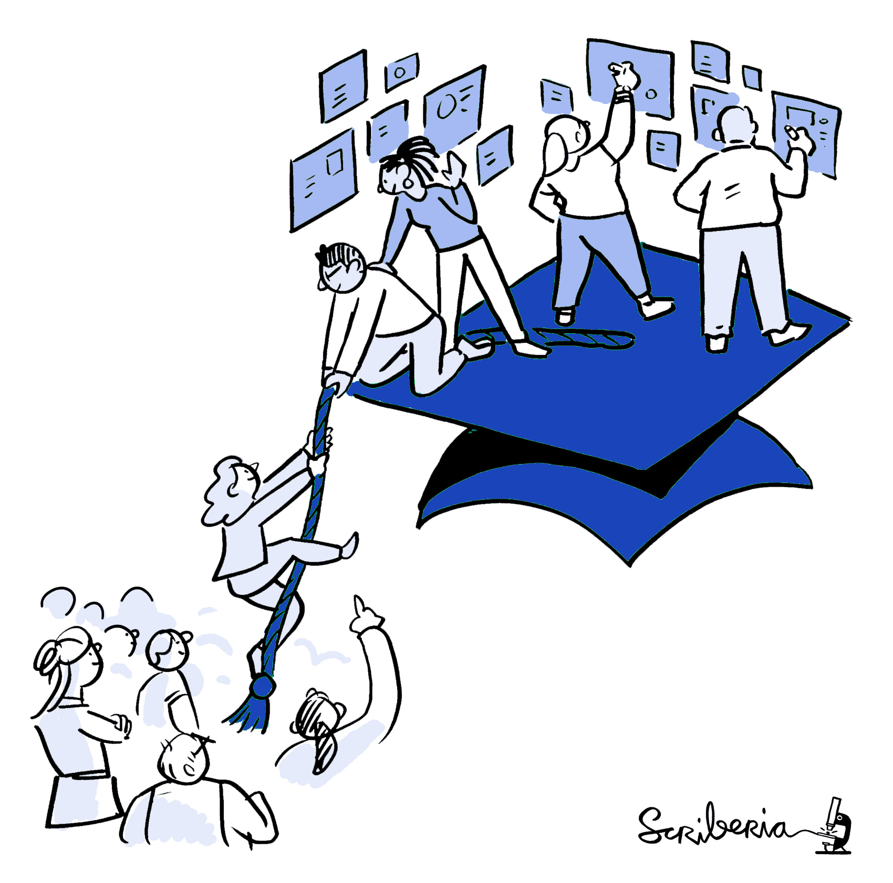

## Open Science

{width=20% height=20%}

I co-founded and have been managing REPOPSI, a repository established at the LIRA Lab in 2020. REPOPSI allows everyone to freely access and share open psychological scales, tests, and other instruments in Serbian. [Use REPOPSI for your next project!](https://www.repopsi.f.bg.ac.rs/en/)

In 2022-2023, I led an EOSC Future and Research Data Alliance funded REPOPSI improvement project. If words such as FAIR, TRUST, and metadata excite you, go here to [learn about REPOPSI project outputs](https://www.rd-alliance.org/eosc-future-grant-repopsi/).

Even more about REPOPSI, including all of the talks and workshops I gave, are [here](https://zenodo.org/communities/repopsi-rda).

---

{width=20% height=20%}

 
With the international community [ABRIR](https://abrirpsy.org/), I advocate for open and equitable big team science. Take a look at the conclusions and a database of useful resources compiled during a [hackathon](https://doi.org/10.5281/zenodo.12119309) for participants from Serbia and Bosnia-Herzegovina.

---

{width=40% height=40%}

An academic article you need is behind a paywall? I wrote a [blogpost](https://doi.org/10.5281/zenodo.13826061) about some tried and trusted ways to find openly accessible versions of articles.

---

For a full list of my publications and outreach activities, please see my [CV](https://drive.google.com/file/d/11AESEI0XEXLnlMkWNHj46Z5cypaX0JGv/view).