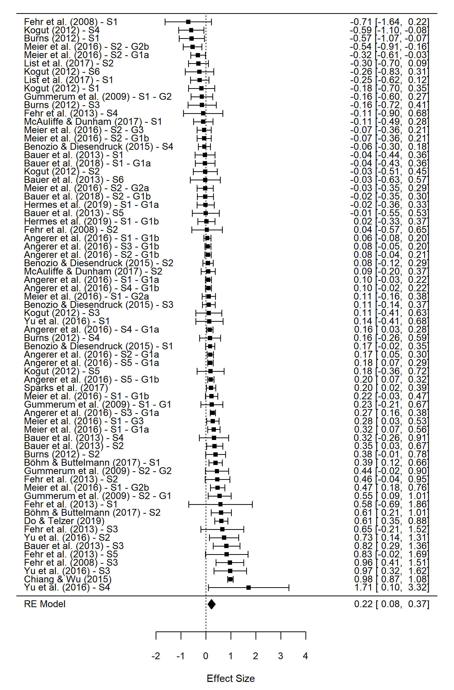

## Research on biases in social dilemmas

Do children and adolescents show bias towards their own group when making others better off comes at a cost to themselves? I led a meta-analysis study synthesizing evidence from 20 experimental economics studies. [Read our paper.](https://doi.org/10.31234/osf.io/uexmr) 

{width=65% height=65%}

---

For a full list of my publications and outreach activities, please see my [CV](https://drive.google.com/file/d/11AESEI0XEXLnlMkWNHj46Z5cypaX0JGv/view).